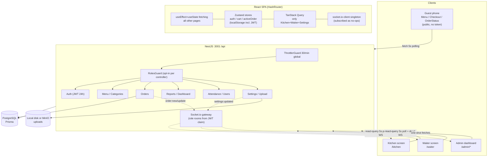

# Tasty Table — Full-Stack Technical Audit & Project Guide

> **Audit date:** August 2026 · **Scope:** every source file in the monorepo (React SPA + NestJS API + Prisma/PostgreSQL + Docker + CI)
> **Method:** direct code inspection with file:line citations. No assumptions; every claim below was verified against the working tree.
> **Audience:** engineering leadership, investors, and the dev team who will fix it.

---

## Table of Contents

1. [Executive Summary](#1-executive-summary)
2. [Architecture Overview](#2-architecture-overview)
3. [Module-by-Module Deep Dive](#3-module-by-module-deep-dive)
4. [Code Quality Findings](#4-code-quality-findings)
5. [Security Findings](#5-security-findings)
6. [Performance Findings](#6-performance-findings)
7. [Database & API Review](#7-database--api-review)
8. [UX/Design Review (Per Persona)](#8-uxdesign-review-per-persona)
9. [Gap Analysis — Path to a Professional Restaurant/Cafe POS Product](#9-gap-analysis--path-to-a-professional-restaurantcafe-pos-product)
10. [Recommended Action Plan](#10-recommended-action-plan)

---

## 1. Executive Summary

### What the system is today

Tasty Table is a **single-location QR-menu + kitchen-screen system**: guests browse a bilingual (AR/EN) menu on their phones, place orders that appear on a Kanban-style kitchen display and waiter screen, track progress by order number, and request the bill. Admins manage menu/staff/branding and view reports and attendance. The stack is modern and coherent: React 18 + Vite + Tailwind/shadcn + Zustand + TanStack Query on the front; NestJS + Prisma + PostgreSQL + Socket.io + MinIO/local storage on the back.

### Maturity verdict: **Solid MVP — NOT production-ready**

The product *works* end-to-end and several engineering choices are genuinely good (atomic order numbering, Cairo-timezone-aware reporting, whitelist DTO validation, prod secret guardrail, last-admin protection). But it fails four non-negotiable bars for commercial restaurant operation:

| Bar | Verdict |
|---|---|
| **Revenue integrity** | ❌ Broken — clients send their own prices (`orders.service.ts:81-89`) |
| **Customer data protection** | ❌ Broken — public unthrottled endpoint leaks phone numbers via sequential IDs |
| **Scale survival** | ❌ Will fall over — dashboard loads entire order history per request; zero pagination API-wide |
| **Operational trust** | ⚠️ Partial — silent settings-save failures, race conditions, payroll-inflating open shifts |

### Top 5 strategic recommendations

1. **Fix pricing server-side this sprint.** Recompute `unitPrice` from `MenuItem` on order creation; never trust the client. This is direct revenue loss today (`orders.service.ts:37-94`).
2. **Close the PII hole.** Rate-limit + tokenize the public order-tracking endpoint and stop returning customer phone to anonymous callers (`orders.controller.ts:44-47`, `schema.prisma:74`).
3. **Make the data layer survive volume.** SQL aggregation for reports/dashboard, add pagination everywhere, index `Order.createdAt` (`dashboard.service.ts:25`, `orders.service.ts:12-17`).
4. **Turn the compiler and tests on.** Frontend ships with `strict:false` and a build script that never runs `tsc` — real type errors are already latent in the tree (`package.json:8`, `tsconfig.app.json:19-23`).
5. **Decide what "real-time" means.** Today WebSockets are subscribed as no-ops while 5-second polling does all the work — either wire the events properly or delete the socket layer and keep polling honestly (`KitchenPage.tsx:67-68`, `useOrders.ts:9`).

---

## 2. Architecture Overview

**What the diagram shows that matters:**

- **Guests never get push updates** — they poll `GET /orders/by-number/:n` every 5s with raw `setInterval` that keeps firing in background tabs (`OrderStatusPage.tsx:32-36`). The gateway has no room for "guest tracking order X".
- **Staff real-time is theater.** Kitchen/Waiter open sockets but register empty handlers (`KitchenPage.tsx:67-68`); freshness comes from react-query's 5s `refetchInterval` (`useOrders.ts:9`).
- **Authorization is opt-in.** There is no global auth guard; each controller must remember `@UseGuards(RolesGuard)`. One forgotten decorator = open API.
- **Two data-fetching idioms coexist** — react-query (kitchen/waiter/settings) vs hand-rolled useEffect chains everywhere else — so cache invalidation between admin edits and guest views is impossible.

---

## 3. Module-by-Module Deep Dive

### 3.1 Auth (`apps/api/src/auth/*`, frontend `src/features/auth/*`, `src/stores/authStore.ts`)

**How it works.** Email/password → bcrypt compare → JWT `{sub,email,role}`, 24h expiry (`auth.module.ts:16`). JWT strategy re-checks user exists and `active` on every request (`jwt.strategy.ts:20-27`) — deactivation kills HTTP access immediately. Login failures are constant-message ("Invalid credentials") including inactive users (`auth.service.ts:16-21`). Staff get a one-time temporary password displayed in admin UI (`StaffManagement.tsx:202-231`) with `mustChangePassword` forcing a change page.

**Strengths.** Constant-time-ish failure paths; no hardcoded JWT fallback (refuses to boot on known-bad secret in prod, `main.ts:12-19`); bcrypt cost 10; login throttled to 10/min (`auth.controller.ts:34`).

**Weaknesses.**
- **No refresh tokens, no logout, no revocation.** Password change does not invalidate existing JWTs — fired staff keep API access up to 24h.
- **WebSocket auth is weaker than HTTP:** verifies signature only, skips the `active` check, and joins role rooms from the *stale token claim* (`websocket.gateway.ts:42-50`). A demoted/deactivated user keeps receiving kitchen events until token expiry.
- **JWT stored raw in localStorage** (`api.ts:62`, `authStore.ts:39`) — readable by any XSS.
- **No 401 lifecycle on the client:** expired token = infinite generic error toasts while the UI still believes it's logged in (`api.ts:47-50`; `selectIsAuthenticated` is just `user !== null`, `authStore.ts:59`).
- Dead code: `common/guards/jwt-auth.guard.ts` is registered nowhere.
- Bug: `ChangePasswordPage.tsx:27-30` calls `navigate()` during render instead of an effect.

### 3.2 Menu & Categories (`menu/*`, `src/features/menu/*`, `src/features/admin/components/MenuManagement.tsx`)

**How it works.** Categories/menu-items CRUD (admin) + public read endpoints. Soft-delete via `deletedAt` on items (`schema.prisma:47`), `available` toggle for 86'd items. Guests fetch both lists once on mount with `useEffect` (`MenuPage.tsx:26-47`) — not react-query, so an admin price change can't invalidate a cached guest view.

**Strengths.** Clean public/private split; indexes on `categoryId/available/deletedAt`; category deletion protected by FK `Restrict` after a migration fixed an earlier CASCADE foot-gun.

**Weaknesses.**
- Public menu/category endpoints have **no caching layer** — every QR scan hits PostgreSQL.
- `updateCategory` exists in the API and `api.ts:97-105` but has **no UI** — categories can't be renamed from the app.
- Item images silently default to a hardcoded Unsplash URL when missing (`MenuManagement.tsx:105`).
- Delete confirmations use `window.confirm` — jarring and untranslatable.

### 3.3 Cart & Checkout (`src/stores/cartStore.ts`, `src/features/checkout/components/CheckoutPage.tsx`)

**How it works.** Cart persists full `MenuItem` snapshots to localStorage under `tastytable.cart` (`cartStore.ts:23-31`). Checkout posts name/phone/orderType/tableNumber/notes plus per-item `menuItemId`, localized names, quantity, variant label, and a **client-computed `unitPrice`** (`CheckoutPage.tsx:52-56`).

**Strengths.** Variant price adjustment included in totals; identity key `(itemId,variantId)` prevents duplicate lines; table number required for dine-in.

**Weaknesses.**
- **The payload invites price tampering** — and the server accepts it verbatim (see §3.4). Even without malice, a cart saved yesterday replays yesterday's prices.
- Item names freeze in the language the guest was browsing — kitchen tickets can show Arabic names to an English-speaking line cook (`KitchenPage.tsx:341` renders `nameAr` when `isArabic`).
- `loadCart()` executes three times at module init (`cartStore.ts:34,:82,:83`).
- No phone-format validation, no table-range sanity check, no max-quantity guard.

### 3.4 Orders — the heart (`orders/*`)

**Lifecycle.** `received → preparing → ready → completed`, one-directional; forward jumps allowed, backward/same-state rejected (`orders.service.ts:147-168`). Bill flow: guest sets `billRequested` (public endpoint), waiter acknowledges → `paymentStatus:"paid"`. Order numbers come from a single-row atomic counter inside `$transaction` (`:63-68`) — collision-safe by row lock, seeded at 1001.

**Strengths.** Atomic numbering; transaction at creation; status machine enforced with tests covering legal/illegal transitions (`orders.service.spec.ts:126-205`).

**Weaknesses (ranked):**
1. **CRITICAL — client-controlled pricing.** `CreateOrderItemDto` accepts `unitPrice` and item names; `create()` persists them without ever loading `MenuItem.price` (`orders.service.ts:81-89`). Any anonymous user can order a steak for 0.00; every revenue report then computes from attacker-chosen numbers. This is finding #1 for a reason.
2. **HIGH — public tracker leaks PII.** `GET /orders/by-number/:n` is `@Public()` with **no dedicated throttle** (`orders.controller.ts:44-47`), returns the full order **including customer phone** (`schema.prisma:74`), and numbers are sequential integers — a trivially scrapeable customer database.
3. **MEDIUM — TOCTOU races.** Status transitions do find-then-update with no conditional update or version column (`:153-164`); two concurrent PATCHes can both pass validation and land out of order (last-write-wins).
4. **MEDIUM — bill logic holes.** `requestBill*` flags even already-paid orders (`:102-130`); `acknowledgeBill` blindly sets paid without checking state (`:132-145`); dead method `requestBill(id)` has no route (`:102-115`).
5. Bogus `menuItemId` passes DTO validation then dies on FK as a generic **500** (no Prisma error mapping anywhere).
6. **No pagination:** `findAll()` returns every order ever made with items (`:12-17`) — consumed by OrderHistory and sliced to 10 by the dashboard (`AdminDashboard.tsx:99,108`).

### 3.5 WebSocket Gateway (`websocket/websocket.gateway.ts`)

Emits `order:new`, `order:updated` to role rooms derived from JWT claims; `settings:updated` to all staff rooms; disconnects unauthenticated sockets. Token accepted from handshake auth **or query string** (`:33-35` — the latter leaks into proxy/access logs).

**Verdict:** correct skeleton, wrong wiring. The frontend subscribes and discards (`KitchenPage.tsx:67-68`, `WaiterPage.tsx:70-71`), and `disconnectSocket()` tears down the shared singleton for *all* consumers while leaving stale handlers registered (`socket.ts:41-47`) — navigating away from Kitchen can sever the live-settings connection used by Navbar/BrandingProvider. Also: `useSettings.ts:17-30` reads the token once into its effect closure, so a user logging in after mount never gets a socket at all.

### 3.6 Reports & Dashboard (`reports/*`, `dashboard/*`, `AdminDashboard.tsx`)

Genuinely thoughtful timezone work: Cairo-anchored day boundaries and bucketing via `formatInTimeZone` (`reports.service.ts:7-22,:111,:128`). But:

- **All aggregates are fetch-everything-then-reduce-in-JS** — summary/revenue/top-items load all orders + items for the range (`reports.service.ts:48-57,:101-104,:195-198`). A year of data = full-table scan materialized in Node memory per request.
- **Dashboard is worse:** `prisma.order.findMany({include:{items:true}})` with **no where/take at all** (`dashboard.service.ts:25`) — entire history per dashboard view to compute a top-5.
- Weekly bucket math mixes Cairo formatting with server-local `getDay/setDate` (`:148-151`) — wrong week boundaries on any non-Cairo server.
- "Today" disagrees between modules: dashboard uses server-local midnight (`dashboard.service.ts:10`), reports use Cairo — the two screens will disagree after 22:00 UTC.
- Top-items revenue counts all payment statuses while summary counts paid-only (`:196` vs `:62-63`) — numbers that don't reconcile, undocumented.
- Invalid date params silently fall back to defaults instead of 400 (`:20-21`); same for attendance queries.
- Frontend: seven parallel fetches per dashboard load, one being the entire orders list sliced to 10 (`AdminDashboard.tsx:92-108`); manual-refresh only; no caching.

### 3.7 Attendance (`attendance/*`)

Clock-in/out with notes; admin sees records + per-staff summaries. Indexes exist (`userId,clockIn`). Problems:

- **Open-shift detection isn't scoped to today** (`attendance.service.ts:28-33`) — a forgotten clock-out blocks future clock-ins until someone closes a monster shift days later.
- **Double clock-in race:** two concurrent POSTs both pass the open-record check (`:40-47`); no transaction, no partial unique index. Summaries then double-count.
- **Unclosed shifts inflate payroll unboundedly:** minutes computed with `clockOut ?? new Date()` (`:112`) — every admin refresh accrues more paid time.
- Overnight shifts attribute all minutes to the clock-in day (`:111`).
- No admin corrections (edit/close-on-behalf/delete), no breaks, no grace periods. Raw `from/to/userId` query params go straight into Prisma where-clauses unvalidated (`attendance.controller.ts:45-55`).

### 3.8 Settings & Branding (`settings/*`, `BrandingProvider.tsx`, `BrandingSettings.tsx`)

Public GET returns restaurant branding (name/logo/colors/socials); admin-only write/reset; WebSocket broadcast on change; provider maps hex→HSL CSS variables at runtime with contrast-aware foreground derivation (`BrandingProvider.tsx:42-52`). Frontend form is the only react-hook-form+zod screen in the app (`BrandingSettings.tsx:19-36`).

**The ugly part:** `SettingsService.get/update/reset` wrap everything in try/catch and return fabricated merged defaults on ANY database error (`settings.service.ts:30-39,:66-74,:82-87`). An admin "save" that failed returns success-shaped data that was never persisted. Silent data loss masquerading as success — and the unit tests codify this behavior as *desired*. This was introduced to mask a migration issue; the migration now applies, so the bandage should come off.

### 3.9 Storage/Upload (`storage/*`)

Admin-only `POST /upload/image`, 5 MB limit, mimetype filter, local-disk driver served statically at `/api/uploads` (`main.ts:30-33`) or MinIO with auto-created bucket.

**Weaknesses:** filter trusts the client-declared mimetype (`storage.controller.ts:17-22`) — no magic-byte sniffing; **SVG passes** and is served inline from the same origin → stored XSS against staff browsers (tokens live in localStorage, so one phished admin upload = session theft). MinIO objects get **public-read** policy for the whole bucket (`storage.service.ts:45-57`); credentials fall back to `minioadmin/minioadmin` in code (`:39-40`); writes are synchronous on the event loop (`:87`); driver selection treats anything ≠ `"local"` as minio, typos included (`:21-23`).

### 3.10 Bootstrap & Cross-cutting (`main.ts`, `app.module.ts`)

Good: global prefix, Helmet, ValidationPipe with `whitelist+forbidNonWhitelisted+transform` (`main.ts:41-47`), CORS allow-list with credentials, trust-proxy=1, global 30/min throttler, catch-all exception filter that hides internals in prod.

Bad: **no global auth guard** (deny-by-default absent); `bootstrap()` lacks `.catch()` (`main.ts:55`); no health/readiness endpoint (compose checks postgres only, `docker-compose.yml:12-16,:48-50`); no JSON body-size tuning; WS gateway logs via bare `console.log` (`websocket.gateway.ts:52,:59`).

---

## 4. Code Quality Findings

Severity reflects real-world business impact.

### 🔴 Critical

| # | Finding | Location |
|---|---|---|
| CQ-1 | Order prices, item names, and quantities accepted verbatim from anonymous client; server never recomputes from `MenuItem` | `apps/api/src/orders/orders.service.ts:81-89`, DTO `orders.controller.ts:10-18`, sender `CheckoutPage.tsx:52-56` |
| CQ-2 | Zero pagination in the entire API; `findAll` returns all orders + items forever | `orders.service.ts:12-17`; confirmed absent across all controllers |
| CQ-3 | TypeScript strictness disabled on frontend AND build never typechecks (`build = vite build`), so latent errors ship: phantom `Clock` reference; nonexistent `t.notFound` key | `tsconfig.app.json:19-23`, `package.json:8`, `KitchenPage.tsx:100` vs imports `:13-16`, `NotFound.tsx:10` |

### 🟠 High

| # | Finding | Location |
|---|---|---|
| CQ-4 | Settings service swallows ALL DB errors and fabricates success responses (silent data loss; tests bless it) | `settings/settings.service.ts:30-39,:66-74,:82-87` |
| CQ-5 | Race conditions on status transitions (read-then-write, no optimistic locking) and attendance clock-in (duplicate open shifts) | `orders.service.ts:153-164`, `attendance.service.ts:40-47` |
| CQ-6 | Two competing fetch idioms; ~9 pages bypass react-query entirely (no cache coherence between admin edits and guest views) | `MenuPage.tsx:26-47`, `CheckoutPage.tsx:40-69`, `AdminDashboard.tsx:76-121`, `MenuManagement.tsx:22-58`, `StaffManagement.tsx:20-41`, `OrderHistory.tsx:24-41`, `AttendancePage.tsx:85-116`, `OrderStatusPage.tsx:21-74` |
| CQ-7 | Reports aggregate in JS over unbounded scans; weekly buckets mix timezones; "today" defined differently in dashboard vs reports | `reports.service.ts:48-57,:148-151`, `dashboard.service.ts:10` |

### 🟡 Medium

| # | Finding | Location |
|---|---|---|
| CQ-8 | Prisma errors unmapped → unique violations, bad UUIDs, FK failures all surface as generic 500s | e.g. `users.service.ts:27-28` (racy pre-check), `menu.service.ts:18,:73,:81` |
| CQ-9 | Raw query params (`from/to/userId`) unvalidated into Prisma where-clauses across reports + attendance | `reports.controller.ts:13-33`, `attendance.controller.ts:45-55` |
| CQ-10 | Duplicated/dead code: `ORDER_STATUS_FLOW` declared twice; unused `updateCategory` API; dead `requestBill(id)`; dead `jwt-auth.guard.ts`; orphan `hooks/use-toast.ts`+`ui/toast.tsx`; orphan `App.css`; `en.ts` exports an unused second `TranslationKeys`; framer-motion installed but unused; `next-themes` used only inside sonner while Navbar implements its own dark mode | `types.ts:123-128` vs `constants.ts:1`; `api.ts:97-105`; `orders.service.ts:102-115`; `eslint.config.js:23` disables `no-unused-vars` |
| CQ-11 | `cartStore` triple-parses localStorage at boot; carts replay stale price snapshots | `cartStore.ts:34,:82-83`, `cartStore.ts:23-31` |
| CQ-12 | Bilingual hardcoded ternaries scattered outside the i18n dictionaries (i18n drift) | `KitchenPage.tsx:54-55,:149,:162`, `WaiterPage.tsx:57-59,:84-85,:92-93` |

### 🟢 Low

| # | Finding | Location |
|---|---|---|
| CQ-13 | Empty-DTO no-op updates succeed silently (`UpdateCategoryDto`/`UpdateMenuItemDto` allow `{}`) | `menu.controller.ts` |
| CQ-14 | `bootstrap()` without `.catch()`; HMR error overlay disabled in dev hides errors | `main.ts:55`, `vite.config.ts:11-13` |
| CQ-15 | Non-null assertions on report data (`topItems!.`) | `AdminDashboard.tsx:375-376` |
| CQ-16 | Backend TS strictness partial (`strictNullChecks/noImplicitAny` on; `strictBindCallApply` off); frontend fully off — inconsistent bar | `apps/api/tsconfig.json` vs `tsconfig.app.json` |

**Credit where due:** atomic order counter, forward-only status machine with unit tests, whitelist validation pipe, Cairo-TZ discipline in reports, last-admin protection (`users.service.ts:53-58,:75-80`), route-level code splitting shipped correctly, mostly logical RTL properties.

---

## 5. Security Findings

### 🔴 Critical

| # | Finding | Remediation |
|---|---|---|
| SEC-1 | **Client-controlled pricing on a public endpoint** — anonymous users dictate what they pay; corrupts revenue + reports | Server loads `MenuItem` (+variant) by ID and computes `unitPrice` itself; strip price/name fields from the public DTO |
| SEC-2 | **PII leak via enumerable public tracker** — sequential numbers from 1001, unthrottled, response includes customer `phone` (`schema.prisma:74`) | Add throttle; drop phone/email from public projection; add random tracking token per order; stop sequential guessability |

### 🟠 High

| # | Finding | Remediation |
|---|---|---|
| SEC-3 | JWT in localStorage + zero 401 handling → XSS = full staff-session theft, expired tokens fail silently | HttpOnly cookie session or at minimum in-memory token + refresh rotation; global 401 interceptor that logs out |
| SEC-4 | SVG upload served same-origin inline → stored XSS vector (filter trusts client mimetype only) | Block `image/svg+xml`; magic-byte sniffing (file-type pkg); serve uploads from separate domain/subdomain with `Content-Disposition` |
| SEC-5 | No token revocation lifecycle; WS skips `active` check and trusts stale role claims for rooms | Token version column checked in strategy + WS handshake; short-lived access + refresh tokens |
| SEC-6 | Auth is opt-in per controller — one forgotten `@UseGuards(RolesGuard)` ships an open API | Global `JwtAuthGuard` as APP_GUARD with `@Public()` opt-out (RolesGuard pattern already supports it) |
| SEC-7 | Default/weak credentials in compose + code fallbacks (`postgres/postgres`, `minioadmin/minioadmin`); app runs as Postgres superuser | Required env interpolation for all secrets; least-privilege DB role; remove code-level fallbacks |

### 🟡 Medium

| # | Finding | Remediation |
|---|---|---|
| SEC-8 | WS token accepted via query string (log leakage) | Handshake auth only |
| SEC-9 | Roles are free-form strings end-to-end (no enum) | Prisma `enum Role`; single source shared with frontend types |
| SEC-10 | `.env` committed to git (dev values, but history persists) | Purge from history; provide `.env.example` only |
| SEC-11 | No audit log of privileged actions (price changes, user deletion, voids don't exist yet but will be needed) | Audit-log table + interceptor on mutating admin endpoints |

---

## 6. Performance Findings

### 🔴 Critical

| # | Finding | Impact | Fix |
|---|---|---|---|
| PF-1 | Dashboard loads **entire order history + items** per request | Multi-second responses, RAM growth, eventual OOM | SQL `groupBy(menuItemId)` top-5; recent orders `take:10` already partially exists (`dashboard.service.ts:42`) |
| PF-2 | Reports scan all orders/items in range into Node for any aggregate | Linear degradation; year-range = outage risk | `aggregate`/`groupBy` in SQL; pre-aggregated daily rollup table later |
| PF-3 | Missing plain `Order.createdAt` index — range queries that don't filter status/type hit none of the composites | Seq scans on the hottest table | `@@index([createdAt])`; drop redundant `@@index([orderNumber])` duplicate of `@unique` (`schema.prisma:87`) |

### 🟠 High

| # | Finding | Impact | Fix |
|---|---|---|---|
| PF-4 | Polling-everywhere architecture: staff boards 5s refetchInterval + guests raw 5s `setInterval` that ignores tab visibility | API load scales with idle open tabs; 5s-stale ops during rush despite having a WS gateway | Make WS actually drive updates; react-query intervals for guests pause when hidden — migrate guest pages onto it |
| PF-5 | Whole-board re-render every 10s: parent `now` state threaded through every card (`formatElapsed` freshness hack) | O(n) wasted renders exactly during rush | Per-card self-contained timer component (memoized), tick only visible cards |
| PF-6 | Zero memoization on hot screens; sorts/filters rebuild every render; no list virtualization on menu grid/order history/attendance table | Jank as data grows | Memoize column grouping; virtualize long lists |

### 🟡 Medium

| # | Finding | Fix |
|---|---|---|
| PF-7 | Sync `writeFileSync` for uploads blocks the event loop (up to 5 MB) | `fs.promises` / streams |
| PF-8 | No HTTP caching/ETag on public menu/categories/settings; every QR scan hits Postgres | Cache headers + in-memory TTL or CDN |
| PF-9 | recharts imported eagerly into dashboard chunk; dashboard also downloads all orders to slice 10 | Already lazy-routed (good); switch chart lib usage to per-chart import; use `take:10` endpoint |
| PF-10 | Images lack width/height (CLS); checkout thumbnails lack lazy/onError fallback that menu grid has; background image unoptimized, no srcset/preload | Standardize image component with dimensions + fallback + lazy |

---

## 7. Database & API Review

### Schema critique (`apps/api/prisma/schema.prisma`)

| Issue | Evidence | Consequence | Recommendation |
|---|---|---|---|
| **Money as Float** | `MenuItem.price :44`, `priceAdjust :64`, `OrderItem.unitPrice :105` (DOUBLE PRECISION since init migration) | Binary float cent-drift across thousands of line items corrupts accounting | Migrate to `Decimal @db.Decimal(10,2)` (or integer piasters) |
| **No enums** | `role :15`, `orderType :75`, `status :79`, `paymentStatus :80` are free-text | Nothing stops `status='banana'` at DB level; typo states possible | Prisma enums for all four |
| Missing hot-path index | Only composite `(status,createdAt)` etc.; plain `createdAt` absent | Unfiltered date-range reports seq-scan | `@@index([createdAt])` |
| Redundant index | `@@index([orderNumber]) :87` duplicates `@unique :72` | Write amplification for nothing | Drop it |
| Attendance cascade | `User→Attendance onDelete:Cascade :116` | Deleting a user destroys payroll history | Restrict + soft-delete users |
| Soft-delete inconsistency | Only MenuItem has `deletedAt :47` | Orders/users hard-delete; no undo, no retention story | Extend soft-delete policy deliberately |
| Singleton-by-convention | `RestaurantSettings id` free-form; `OrderCounter id="singleton"` magic string | No enforcement of one-row invariants | CHECK constraints or seed-guarded convention docs |
| No multi-tenancy groundwork | No branchId anywhere | Every future multi-branch feature = painful migration | At minimum design tables with `branchId String?` placeholder strategy documented |

### API review

- **Consistency is decent:** REST-ish nouns, `/api` prefix, consistent DTO validation where present.
- **Missing endpoints a real operation needs:** void/cancel order (with reason), refund, discount application, order edit before preparation, menu availability schedules, category reorder, paginated/list-filtered orders (`?status=&from=&cursor=`), admin attendance corrections, health/readiness.
- **Error contract gaps:** no Prisma error mapping (P2002/P2025/FK → 500s); invalid date/id params silently coerced rather than 400.
- **Versioning:** none — fine for internal MVP, plan `/v1` before external integrations.
- **Response shape:** orders include full item rows everywhere (including public tracker) — needs explicit projections per audience.

---

## 8. UX/Design Review (Per Persona)

The visual design pass landed well (tokenized colors/fonts/shadows, dark mode, EmptyState, skeletons, reduced-motion support). Findings below are operational, not cosmetic.

### Guest (customer phone)
- ✅ Bilingual, RTL-first, persistent "#number · status" chip, clean progress tracker.
- ❌ **Status freshness depends on keeping the tab foreground** — raw intervals keep polling in background but react-query pauses hidden tabs; either way the experience lags up to 5s+ (`OrderStatusPage.tsx:32-36`).
- ❌ Cart replays stale prices if saved earlier (`cartStore.ts:23-31`).
- ❌ Progress stepper is purely visual — no `aria-current`, nothing for screen readers (`OrderStatusPage.tsx:126-148`).
- ❌ No order notes confirmation, no ETA estimate, no "kitchen is busy" feedback.

### Kitchen (rush-hour reality)
- ❌ **No sound/strong alert on new orders** — relies solely on toast bubbles with no `aria-live`; a busy line misses them (`KitchenPage.tsx:51-59`).
- ❌ After tapping "Start Preparing", nothing changes visually until the next 5s poll — **no optimistic update**, cooks tap twice, double-taps hit the race condition in §3.4.
- ❌ Whole board re-renders every 10s; urgency ring only at ≥15 min with no escalation.
- ❌ Tickets can display item names in the *customer's* language (`KitchenPage.tsx:341`) — wrong-language tickets slow the line.
- ❌ No bump-bar ergonomics (large touch targets exist, but no keyboard shortcuts, no done-sound, no recall-last).

### Waiter
- ❌ Same no-optimistic-update lag on acknowledge/deliver.
- ❌ Bill-request badge pulses but there's no audible cue; during rush the orange column is easy to miss.
- ❌ Totals recomputed inline per render; fine today, wasteful at scale.
- ❌ Toast copy hardcoded bilingual ternaries instead of dictionary keys (drift risk).

### Admin
- ❌ Dashboard is manual-refresh only — no auto-refresh, no cache; seven parallel calls each visit (`AdminDashboard.tsx:92-108`).
- ❌ Numbers may not reconcile (summary counts paid-only revenue; top-items counts all — §3.6) — leadership will notice.
- ❌ Category rename impossible (API exists, UI doesn't).
- ❌ Staff temp-password modal is good; but no password reset/self-service beyond forced-change flow.
- ❌ RTL bugs remain: branding remove-image button anchored physically right (`BrandingSettings.tsx:81`), cart badge offsets physical (`Navbar.tsx:136,:172`), dashboard indent `ml-7` (`AdminDashboard.tsx:502`).
- ❌ **Language-switch bug:** `<html dir>` only updated inside `setLanguage` (`i18n/index.tsx:35-36`); a returning English user gets LTR content under `dir="rtl"` until they toggle language once (`index.html:2` hardcodes rtl/ar).
- ❌ Mobile sidebar overlay declared `role="button"` with `tabIndex={-1}` — keyboard-invisible (`AdminLayout.tsx:134-136`).

---

## 9. Gap Analysis — Path to a Professional Restaurant/Cafe POS Product

### What exists today vs. what a commercial product needs

| Capability | Commercial POS baseline | Tasty Table today |
|---|---|---|
| Ordering | ✅ | ✅ Basic dine-in/takeaway, no scheduled orders |
| Pricing integrity | Server-authoritative | ❌ Client-supplied |
| Payments | Full lifecycle (partial, split, refunds, voids, tips) | ❌ Single boolean paid/unpaid |
| Tables | Floor plans, sessions, merge/split | ❌ Just an integer field |
| Inventory | Stock decrement, recipes, low-stock alerts | ❌ None |
| Discounts/Promos | Codes, happy hour, item mods | ❌ None |
| Taxes & service charge | Configurable, receipt-level | ❌ None |
| Receipt printing | ESC/POS, kitchen printers | ❌ None |
| Multi-branch | Tenant/branch model, per-branch menus | ❌ Single location hardcoded |
| Permissions | Granular roles, audit trail | ⚠️ 4 fixed roles, no audit |
| Offline resilience | Queue-and-sync for POS terminals | ❌ None |
| Hardware | Printers, cash drawers, scanners | ❌ None |
| Analytics | Cohorts, item margins, forecast, exports | ⚠️ 5 basic reports, JS-computed |
| Loyalty/CRM | Points, visits, campaigns | ❌ None |
| Reservations | Bookings, waitlist | ❌ None |

### Prioritized roadmap

**NOW (revenue & trust blockers — weeks 1-4)**
1. Server-side pricing (SEC-1) + order projections (SEC-2)
2. Pagination + dashboard/report SQL aggregation + `createdAt` index (PF-1..3)
3. Auth hardening: global guard, token revocation on password change, 401 interceptor (SEC-3..6)
4. Settings persistence honesty (CQ-4); Prisma error mapper (CQ-8)
5. Optimistic status updates + audio/aria-live alerts on kitchen/waiter
6. Money → Decimal migration; enums for status/role/payment

**NEXT (operational completeness — months 2-4)**
7. Void/cancel with reasons + audit log; bill lifecycle fixes (no re-flagging paid orders)
8. Table management: sessions, statuses, merge; attendance admin-corrections + overnight-shift handling + partial unique index for open shifts
9. Real WebSockets end-to-end (kill polling on staff screens; guest room per order number)
10. Taxes/service charge config; discounts engine v1 (percent/fixed/item-level)
11. React-query everywhere; enable `strict:true` + `tsc -b` in build; ESLint restore `no-unused-vars`
12. Receipt view (print-friendly HTML → thermal print later)

**LATER (platform ambitions — months 4-12)**
13. Multi-branch tenancy (branchId throughout, per-branch settings/menus/users)
14. Inventory + recipe costing + low-stock automation
15. Loyalty/CRM, reservations, delivery integration
16. Offline-mode PWA for waiter/kitchen (queue-and-sync)
17. ESC/POS printing, hardware integration
18. Analytics depth: margins, cohort retention, forecast; CSV/XLSX exports
19. Granular RBAC + permission editor; full audit-trail UI

---

## 10. Recommended Action Plan

Sprint-sized, sequenced, each independently shippable.

### Sprint 0 — Stop the bleeding (1 week, backend-heavy)
- [ ] **Orders:** recompute prices/names from `MenuItem`+variant server-side; reject unknown/unavailable items with 400; add integration test posting `unitPrice:0` expecting server price (fixes SEC-1/CQ-1)
- [ ] **Tracker:** project public response (drop `phone`); add `@Throttle` to by-number endpoints; add random `trackToken` column returned at creation and required for lookup (fixes SEC-2)
- [ ] **Global guard:** register `JwtAuthGuard` as APP_GUARD; mark the 8 legitimate public endpoints `@Public()` (audit each) (fixes SEC-6)
- [ ] **Settings:** remove swallow-all try/catch now that migration applies; let 500s surface; update tests (fixes CQ-4)
- [ ] Compose: required env for postgres/minio creds; non-superuser app role (part of SEC-7)

### Sprint 1 — Data layer survives reality (1-2 weeks)
- [ ] Migration: `@@index([createdAt])` on Order; drop duplicate orderNumber index
- [ ] `GET /orders` gains `?status=&type=&from=&to=&cursor=&take=` (default take 50); OrderHistory + kitchen use it
- [ ] Dashboard top-items via SQL groupBy; summary/revenue/top-items via aggregate; unify "today" on Cairo TZ in dashboard (`dashboard.service.ts:10`)
- [ ] Prisma exception filter mapping P2002→409, P2025→404, FK→400 (fixes CQ-8)
- [ ] Validate `from/to/userId` params with DTOs (fixes CQ-9)

### Sprint 2 — Money & correctness (1-2 weeks)
- [ ] Decimal(10,2) migration for the three money columns + frontend money helpers adjusted
- [ ] Prisma enums: Role, OrderType, OrderStatus, PaymentStatus (+ share type with frontend)
- [ ] Conditional status transition (`updateMany({where:{id,status:current}})` → conflict 409) fixing TOCTOU (fixes CQ-5a)
- [ ] Attendance: scope open-shift check to today, partial unique index on open shift, admin close/edit endpoints, stop `??now()` inflation (fixes CQ-5b, §3.7)
- [ ] Bill flow: reject request-bill on paid/completed; acknowledge validates flag (fixes §3.4.4)

### Sprint 3 — Frontend integrity (1-2 weeks)
- [ ] `"build": "tsc -b && vite build"`; fix the two latent errors (`KitchenPage.tsx:100`, `NotFound.tsx:10`); flip `strict:true` incrementally module-by-module (fixes CQ-3)
- [ ] Global 401 interceptor → logout + redirect; stop persisting JWT (sessionStorage or memory + refresh endpoint) (fixes SEC-3)
- [ ] Migrate remaining 9 pages to react-query; delete duplicated fetch machinery (fixes CQ-6)
- [ ] Cart: store IDs + rehydrate prices at checkout render, not snapshots (fixes CQ-11)
- [ ] RTL: apply `dir`/`lang` on boot from saved preference (`i18n/index.tsx`); replace physical classes listed in §8 (fixes UX-RTL)

### Sprint 4 — Rush-hour UX (1-2 weeks)
- [ ] Kitchen/Waiter: optimistic mutations + rollback; audio ping + `aria-live` region on new order/bill request
- [ ] Wire WS events for real (replace no-op handlers; fix `disconnectSocket` singleton teardown `socket.ts:41-47`; token refresh on reconnect); guest order room `order:{number}` replacing guest polling
- [ ] Memoize board grouping; per-card timer components; virtualize order history
- [ ] Kitchen ticket language: always both names or admin-configurable ticket language

### Sprint 5 — Operations completeness (2-3 weeks)
- [ ] Cancel/void with reason + audit-log table + interceptor on admin mutations (SEC-11)
- [ ] Tax %/service charge settings + receipt HTML print view
- [ ] Discount engine v1; category rename UI; table sessions v1
- [ ] Health endpoint + compose healthcheck for api; structured logging (replace console.log in gateway)

### Continuous (every sprint)
- [ ] API: e2e smoke suite (supertest) for auth/orders/bill flows; target ≥60% on services
- [ ] Frontend: first real vitest suites — cartStore math, status-flow helper, api error handling (currently `example.test.ts` is the whole suite)
- [ ] CI: run lint + tsc + backend jest + frontend vitest before Pages deploy (today's workflow builds only, `.github/workflows/deploy.yml:34-42`)
- [ ] Load-test the two hot paths (order create, dashboard) with 10k/100k historical orders

---

### Final word

This codebase is a well-above-average MVP: the bones (module structure, validation posture, timezone care, tested core flows) are right, and the design system work is genuinely polished. But it is currently one curious customer with devtools away from free food (SEC-1), one scraper away from a leaked customer list (SEC-2), and one year of order history away from a dashboard that doesn't load (PF-1). Execute Sprint 0–2 and it becomes deployable for a real single-location restaurant; Sprints 3–5 make it defensible; the Later roadmap makes it sellable.
